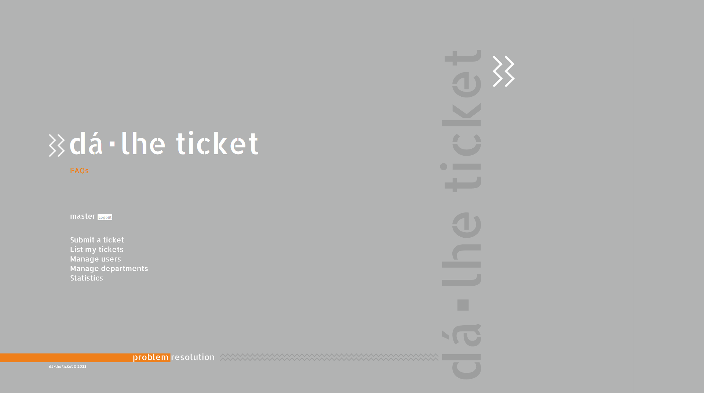
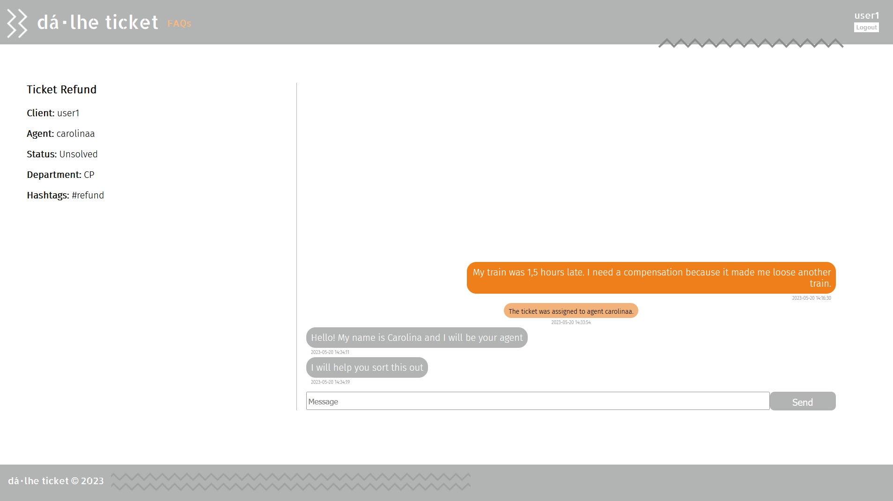
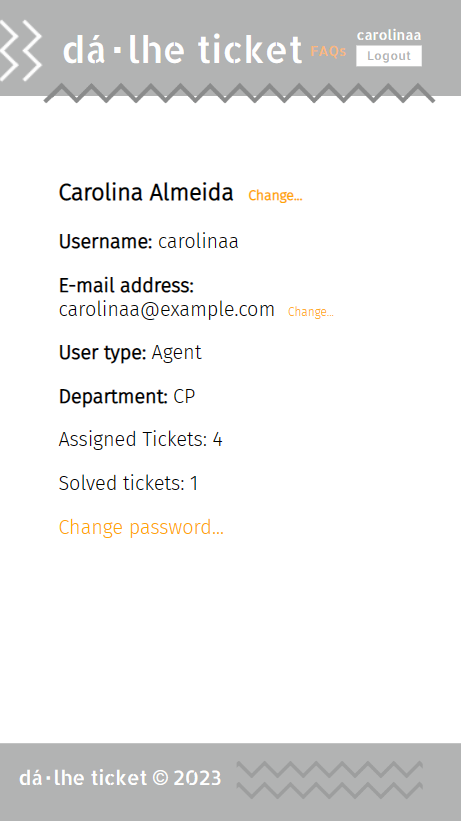

Done with [Pedro Lima](https://github.com/up202108806)

# Dá⬝lhe ticket

__"Dá⬝lhe ticket"__ is a website that has the objective of managing trouble tickets.   
Here's how it works:  
⬝An user can submit a ticket to a department explaining the problem he is facing.  
⬝Posteriorly, an agent can assign that ticket to themselves or to someone else.  
⬝After exchanging messages, hopefully, the ticket will be solved.  
⬝When a ticket is assigned as solved no more messages can be exchanged in that ticket.  
⬝There are also admins, who have almost absolute control over the system, they can create and delete departments, upgrade and downgrade users into agents or even admins and vice-versa, they can change the information about every user, agent and admin, including their password.  
⬝When an agent or admin is searching for a ticket, they can filter by status and date.  

If you download our website and run the PHP server in the project folder, you can see how it works beautifully.  

> __IMP:__ You really need to start the server inside the project folder, if you start it in the repository's home folder it won't work as expected.  

For demostration purposes the password of all users is _"123456"_.  
If you want to enter as an admin there is already a prefined admin account with the email _"master@masters.com"_ and password _"123456"_.  

If you don't have time to download it, you can at least appreciate these screenshots of our website:  
  
  
  
  
